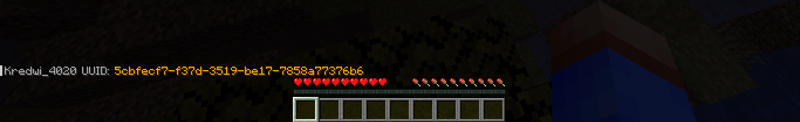

# UUIDView

UUIDView is a small plugin that adds the ability to find out the player's UUID

## Commands
- `/uuidview get [player_name]` - Get UUID online player
- `/uuidview off [player_name]` - Get UUID offline player
- `/uuidview reload` - Reload plugin configuration

## Dependencies
- `SPIGOT API 1.21`

## Known issues
- Optimization

I will be glad of your help
